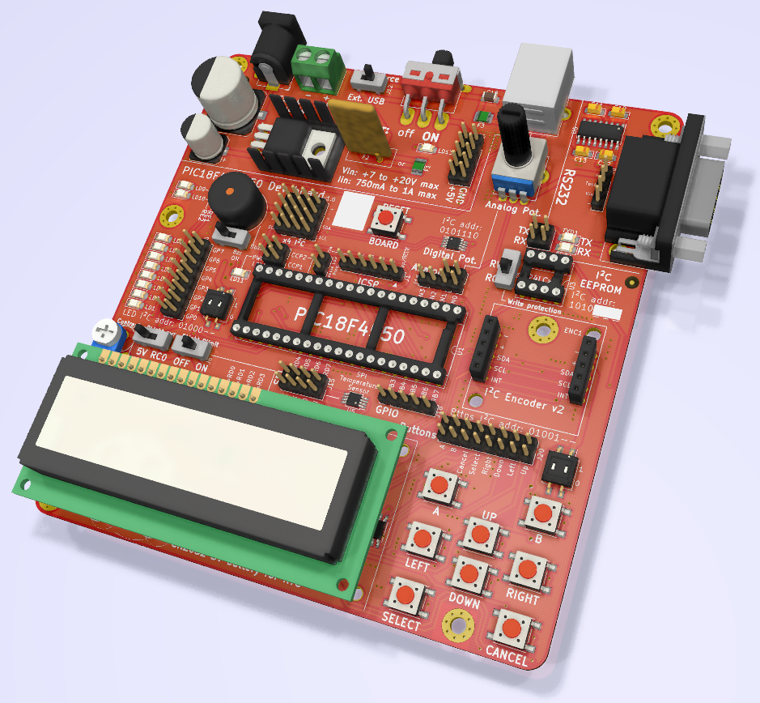
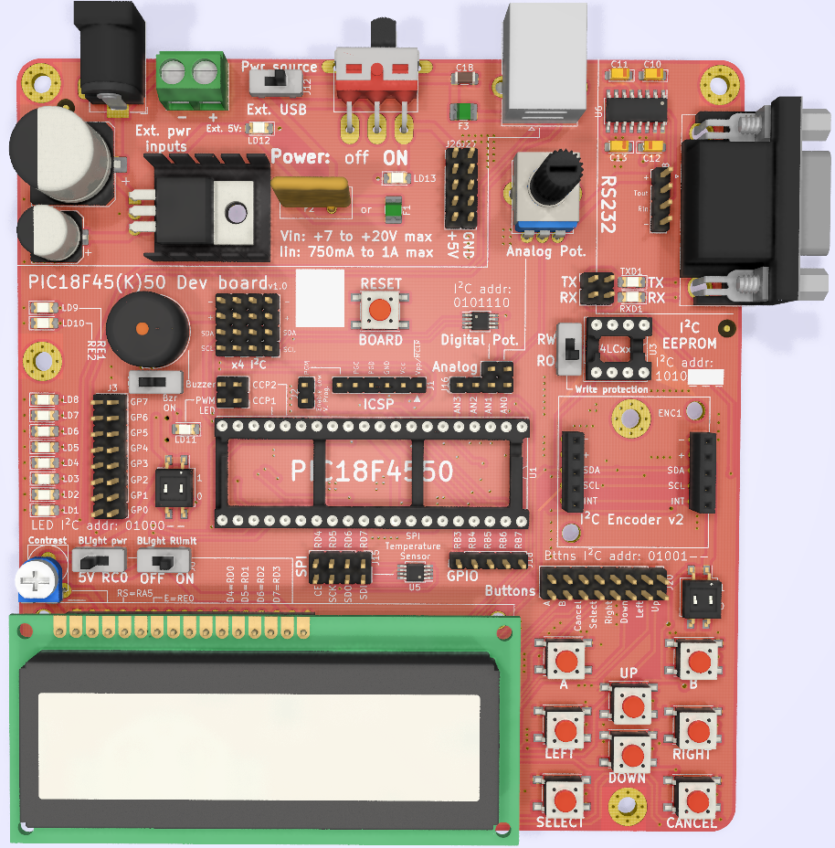
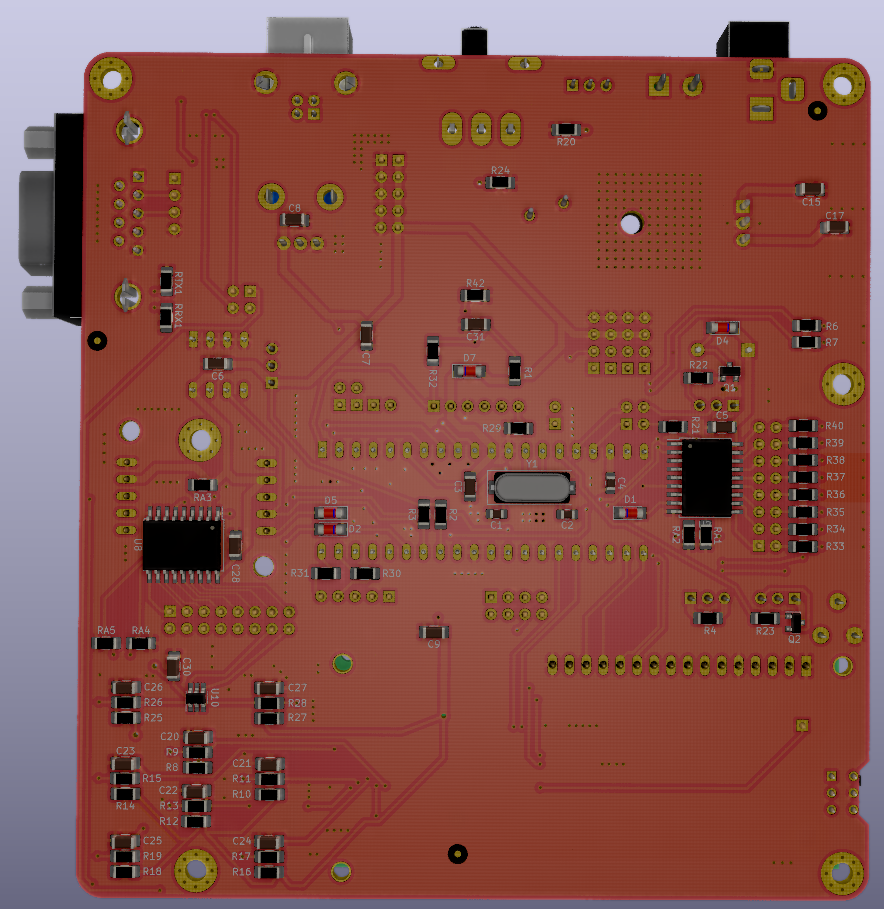

# PIC18F45(K)50 development and demo board

A development board for Microchip's 8 bits microcontroller [PIC18F4550](https://www.microchip.com/wwwproducts/en/PIC18F4550), compatible with [PIC18F45K50](https://www.microchip.com/wwwproducts/en/pic18f45k50).

**This is a work in progress**

## Features

- LCD
- RS232
- SPI temperature sensor
- I²C devices
  - LEDS
  - Buttons
  - ...
- TO COMPLETE
- ...

## BOM

TODO

## How to make

TODO

## Usage

TODO

## Software

TODO

## Pictures

